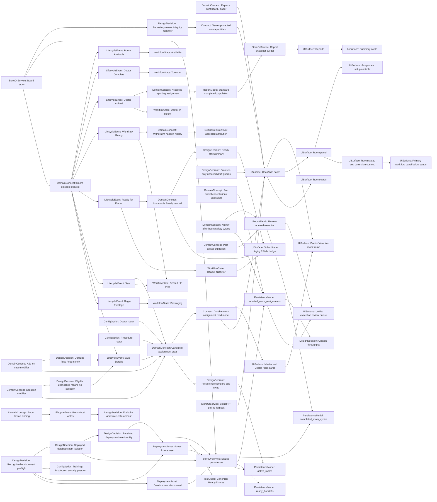

# ChairSide knowledge graph

This hand-authored map records ChairSide's important concepts and relationships. Generated inventory files help locate symbols but are not runtime inputs or substitutes for this intent.

## Conceptual graph

## Core invariants

- ChairSide tracks rooms, never patients, and remains non-PHI.
- The Room panel uses a normal-flow left rail: dynamic status and correction context first, then the existing primary progression controls. Assignment setup remains in the main content area.
- Begin Prestage creates an episode without requiring assignment. Prestaging and Seated allow absent, partial, or complete canonical assignment.
- For an eligible procedure, sedation is an optional modifier: unchecked canonical room drafts normalize to durable `EligibleNo` when saved, seated, or made Ready, while `EligibleUnresolved` remains readable for partial or legacy state.
- Ready requires a complete, valid assignment, persisted either before or atomically with Ready, and is the immutable handoff/assignment-lock boundary.
- `ReadyForDoctor` is the primary state. Aging and Stale are urgency projections from the owned Active handoff's `ReadyAt`.
- Master and Doctor room cards consume the canonical assignment read model when present; partial values use neutral pending language, and Doctor View membership begins only after a doctor assignment is durably saved.
- Withdrawal returns to Seated and starts no new urgency until a different handoff is issued. Doctor Arrived accepts the current handoff.
- Pre-arrival cancellation and max-duration expiration are aborted history outside throughput. Pre-arrival after-hours terminations remain aborted history but also enter the unified review queue. Post-arrival expiration is review-required exception history without a fabricated completion timestamp.
- The after-hours sweep is independently retryable per room: successful rooms remain committed, failed and later active rooms retry, and the clinic day is marked complete only after a successful full pass.
- Canonical lifecycle writes are compare-and-swap guarded against the complete originally loaded room, assignment, handoff, and timestamp expectation. Stale writes do not retry or mutate live state.
- Add-on is optional scheduling-context metadata, defaults to false for every new episode, remains independent of procedure and sedation, stays correctable through Ready, locks after Doctor Arrived, survives active and historical persistence, and remains in ordinary reporting by default. Ready still locks doctor/procedure/sedation/allocation dispatch facts.
- `RoomCapabilitiesEvaluator`, projected through the board store, is authoritative for server-known base action availability. Browser-only unsaved-draft guards remain local, and endpoint/store validation remains final.
- `DemoBoardStore.DeriveIntegrityFaults` is the repository-aware production integrity authority. Faulted rooms remain visible, unsafe progression is blocked without rewriting persisted facts, and supported cancellation and legacy recovery remain available.
- Doctor Arrived serializes durable cross-room doctor ownership and commits the room, Accepted handoff, and reporting cycle together.
- Live state changes only after durable persistence succeeds; SQLite failures roll back transaction-local writes.
- Legacy persisted Aging/Stale rows remain readable; recovery never fabricates or rewrites invalid handoffs.
- Generated knowledge artifacts are development aids and never runtime dependencies.

## Fixture and seed invariants

- Development demo seeding occurs only when all operational tables are empty, persists canonical Ready handoffs, and does not overwrite durable state on restart. Fresh Training and Production databases initialize configured rooms as Available.
- Only Development, Training, and Production are recognized. Unknown names fail before application build, service resolution, database access, log creation, or endpoint mapping.
- Destructive maintenance is allowlisted in Development and Training and refused in Production before application build or repository construction.
- The operator reset wrapper code-owns only the canonical Training app, data, backup, app-pool, and child-environment values; it accepts only an exact Started or Stopped initial pool state, uses bounded polling for asynchronous stop/start transitions, preserves an already Stopped pool, and delegates mutation to existing marker-validating maintenance commands.
- A pool that begins Started is restored in `finally` across Started, Starting, Stopped, or Stopping restoration states. Waits time out with the last observed state, and operation and restoration failures remain separately reportable.
- The isolated `ChairSideBoard-Training` IIS site and app pool serve `http://chairside-training.aospeoria.local` from `C:\ChairSide\Training\App`; Training data, logs, and backups remain under the separate `C:\ChairSide\Training` tree.
- Training board snapshots drive one persistent shared-shell `TRAINING` badge. Development and Production snapshots remove or omit it; hostname inference is never used.
- Production uses only `C:\ChairSide\Data\chairside.db`; Training uses only `C:\ChairSide\Training\Data\chairside-training.db` and logs to `C:\ChairSide\Training\Logs`. Deployed paths fail before SQLite access when they are non-canonical, cross environment boundaries, enter an application/content root, or contain an existing reparse-point component. Development paths remain flexible outside the protected deployed roots.
- Production and Training require matching immutable deployment identity rows before ordinary schema mutation, migration, room initialization, maintenance mutation, or endpoint mapping. Development requires no marker but refuses deployed or malformed marker state.
- Fresh deployed marker and current schema creation are atomic. Existing unmarked deployed databases are always refused. Formal Production begins with a genuinely new canonical database and a new reporting history on the approved go-live date.
- Maintenance reset atomically deletes completed cycles, all Active handoffs, and active rooms, then recreates Available rooms.
- All four row-level maintenance reset/seed entry points preserve the deployment identity exactly.
- Withdrawn, Accepted, and Terminated handoffs and aborted assignments survive maintenance reset.
- Repeated fixtures converge in current state and Active-handoff counts, not total resolved-history rows or generated identities.

## Reporting semantics

- Accepted Ready handoff is finalized assignment attribution.
- Withdrawn handoffs are audit history and never accepted attribution.
- Whole UTC days, Monday-start UTC weeks, and `DoctorCompleteAt` completed-window anchoring remain unchanged.
- Standard completed metrics exclude incomplete cycles and exception populations.
- Ready urgency threshold flags are captured without newly persisting Aging/Stale primary states.

## Completed follow-up work

- Issue #121 / PR #133 (`d902a27`) completed the room-panel workflow, and issue #122 / PR #134 (`2d59c70`) completed canonical master/Doctor View presentation.
- Issue #123 / PR #132 (`9eb5e66`) completed the reporting-population work while preserving the accepted-handoff attribution contract established by issue #120.
- Issue #126 / PR #142 (`47da8f9`) corrected knowledge-graph comment/string false-positive extraction.
- Issues #158 and #159 verified and removed the unused flat Seat and legacy assignment transports while retaining bodyless Ready and Doctor Arrived responses.
- Issue #160 moved assembly-wide test helpers from `BoardStoreTests.cs` into `tests/ChairSide.Board.Tests/TestSupport/`.
- Issue #161 made server-projected room capabilities authoritative, and issue #162 removed the unused context-free integrity evaluator in favor of production store-path coverage.
