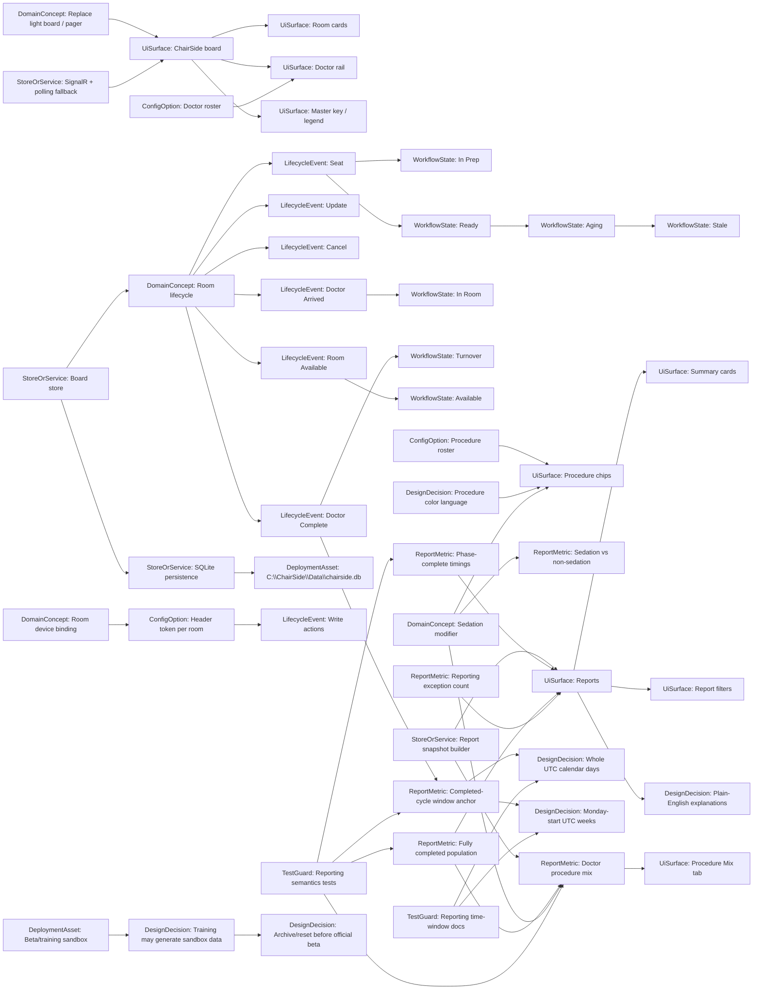

# ChairSide knowledge graph

This is the hand-authored map of ChairSide's important concepts. Keep it readable for humans first. The generated inventory in `generated/` helps locate files, but this document explains why the pieces matter.

## Conceptual graph

## Core invariants

- ChairSide is non-PHI and must stay non-PHI.
- Room lifecycle order is the spine of the app: Seat, Doctor Arrived, Doctor Complete, Room Available.
- Board usability matters more than decorative polish. Avoid visual changes that reduce readability.
- Reports should answer operational questions without turning into a wall of numbers.
- Reporting semantics are test-guarded. Do not “simplify” them without updating tests and documentation intentionally.
- Generated graph artifacts are development aids only; they must not become runtime dependencies.

## Current reporting semantics captured by the graph

- Report date filters use whole UTC calendar days.
- Weekly trends use Monday-start UTC weeks.
- Completed-cycle reporting windows are anchored on `DoctorCompleteAt`.
- Phase-complete timings can contribute before full Room Available completion.
- Fully completed throughput, allocation, schedule-fit, and trend populations exclude incomplete cycles.
- Exception completed cycles can affect relationships between total completed cycles and included completed cycle counts.
- Selected-doctor procedure mix (`ReportsSnapshot.DoctorProcedureMix`, built by `BuildDoctorProcedureMix` in `DemoBoardStore.cs`) is an additive read model over the same standard/included completed-cycle population (`standardCompletedCycles`) as the other calculated metrics. It groups by doctor + procedure variant so sedation variants such as `EXT+SED` stay separate from the base `EXT`, keeping sedation a modifier of the primary procedure via `BaseProcedureCode`/`IsSedationCase`; each `DoctorProcedureMixRow` carries the case count, the doctor's completed-case denominator, and that procedure's share of the doctor's cases.
- Procedure mix renders in the selected-doctor detail panel's `Procedure Mix` tab through `renderSelectedDoctorProcedures` in `board.js`, is guarded by `BoardStoreTests.cs` tests (grouping/shares, per-doctor denominators, excluded/incomplete cycles, blank-doctor skip), and introduced no schema or existing-metric-semantics changes.

## Known development affordances

- Keep PRs small and reviewable.
- Prefer tests and comments that lock intended semantics before bigger refactors.
- Use the graph to preserve deferred ideas, not to force end users into graph concepts.
